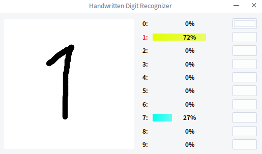

# Handwritten Digit Recognizer

This is a small tool I've written for learning Tensorflow to recognize handwritten digits. You can write a digit in the box with mouse or tablet, and the program will recognize it and display the probabilities of each categories. Press the right mouse button to clear the image. Click the button on the right, and the program will save the image in the corresponding directory.




## Requirements:
- Python
- PySide
- Tensorflow
- python-opencv
- numpy


## Running:
Before use, you need to execute the following command to install dependencies.
```
sudo pip install -r requirements.txt
```
Then you can run the tool by the following command:
```
python recognize.py
```


## Theory
The tool uses a simple neural network architecture shown in the table below to recognize digits. The network is trained on the MNIST dataset (http://yann.lecun.com/exdb/mnist/).

|layer  |parameter                                |shape   |
|-------|-----------------------------------------|--------|
|input  |                                         |28x28x1 |
|conv   |kernel 5x5 filters 6 strides 1 padding 2 |28x28x6 |
|relu   |                                         |28x28x6 |
|pool   |max_pooling stride 2                     |14x14x6 |
|conv   |kernel 5x5 filters 16 strides 1 padding 0|10x10x16|
|relu   |                                         |10x10x16|
|pool   |max_pooling stride 2                     |5x5x16  |
|conv   |kernel 5x5 filters 32 strides 1 padding 0|1x1x32  |
|flatten|                                         |32      |
|dense  |hidden_units 64                          |64      |
|relu   |                                         |64      |
|dense  |hidden_units 10                          |10      |
|output |                                         |        |

You can modify the relevant code in `tf_predict.py` to use your own neural network architecture.

Thanks to Yann LeCun, for both MNIST and LeNet-5.
